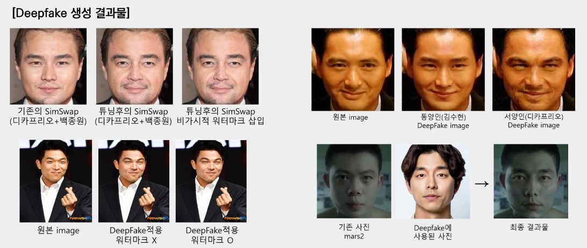
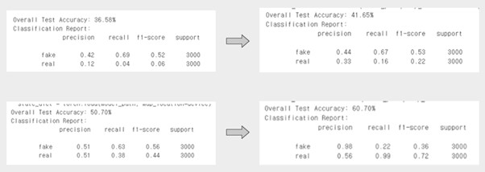
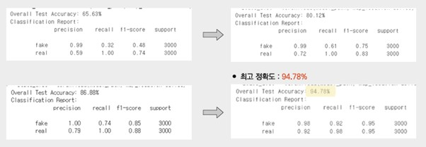
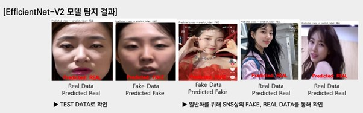

# DeepFake

# **FakeME: 한국인 기반의 Deepfake 생성 및 탐지 시스템**

**FakeME**는 **DeepFake**의 **Fake**와 **Media**의 **ME**를 결합하여 만들어진 이름으로, Deepfake 기술을 활용한 생성 및 탐지 기능을 통합적으로 제공하는 시스템입니다.

---------

## **프로젝트 개요**

**Deepfake**란 DeepLearning과 Fake의 합성어로, 딥러닝 기술을 사용하여 인간 이미지를 합성하는 기술입니다.  
최근 몇 년간 Deepfake의 핵심 기술인 **생성적 적대 신경망(GAN)** 기술의 발전으로, Deepfake 콘텐츠는 육안으로 구분하기 어려울 정도로 높은 수준에 도달하였습니다.

그러나 이 기술은 다음과 같은 **양면성**을 가지고 있습니다:
1. **부정적 사례**  
   - 디지털 성범죄 사건 (예: N번방 사건)  
   - 허위 정보 확산 사례 (예: 대통령, 사업가 관련 가짜 뉴스)  
   - 대한민국 피해자의 비율: 전 세계 Deepfake 피해자의 53% 차지  
2. **긍정적 사례**  
   - 교육: 독립운동가의 모습을 재현하여 실감나는 교육 자료 제공으로 학습 효과 증대  
   - 의료: 고인의 모습을 재현하여 유가족 위로  
   - 광고 및 영화: 비용 절감 및 콘텐츠 몰입도 증대  

FakeME는 이러한 Deepfake 기술의 **양면성**을 연구하여, **생성과 탐지 기능을 동시에 처리하는 통합 시스템**을 구축함으로써 기술의 긍정적 잠재력을 극대화하고 부정적 영향을 최소화하기 위해 개발되었습니다.

---

##  주요 기능

### 기존 Deepfake 서비스의 한계
1. **기능의 단일화**  
   - 생성 또는 탐지 중 하나의 기능에만 집중
2. **한국인 데이터를 활용한 Deepfake 생성 및 탐지 기술이 부족**  
   - 글로벌 데이터셋(FaceForensics++ 등) 기반 모델로 한국인 얼굴 특징에 최적화되지 않음
3. **Deepfake 악용 방지 시스템 부재**  
   - SNS 및 동영상 공유 플랫폼에서 콘텐츠 확산 차단 불가

### 위와 같은 한계를 극복하기 위해 다음과 같은 요구사항 분석을 통해 시스템 개발을 진행
1. **통합 시스템 제공**  
   - Deepfake **생성 및 탐지 기능을 통합적으로 제공**
2. **한국인 데이터 최적화**  
   - 한국인 이미지 데이터를 기반으로 학습한 모델로 **한국인 얼굴 특징에 최적화**
3. **Deepfake 악용 방지 시스템**  
   - SNS 및 동영상 공유 플랫폼에서 Deepfake 콘텐츠가 가장 빠르게 확산된다는 점을 고려하여 **플랫폼 내에 본 시스템을 도입하여 운영**
   - Deepfake 게시물임을 밝혀 **부적절한 콘텐츠 확산을 사전에 방지**하고 **사람들이 오해하여 발생할 수 있는 허위 정보 확산을 방지**

---

## **서비스 및 시스템 구조**

1. **SNS 미 동영상 공유 플랫폼 내에서 본 시스템을 도입하여 운영**
2. **한국인 이미지 데이터를 기반으로 학습하여 한국인의 얼굴 특징에 최적화된 모델 개발**
3. **Deepfake 생성 및 탐지 기능을 통합적으로 제공하는 시스템 개발**

   
---
## **서비스 주요 기능**
### 1. Deepfake 생성 기능
- Source Image(얼굴 이미지)와 Target Image(배경 이미지)를 사용자로부터 입력받아 Deepfake 콘텐츠를 생성해준다. 사용자는 생성된 Deepfake 콘텐츠를 확인하고, 다시 재생성 요청을 하거나 다운로드 받을 수 있다. 

### 2. Deepfake 탐지 기능
- SNS 및 동영상 공유 플랫폼에 게시물을 올리기 전 Deepfake 콘텐츠 여부를 탐지한다. 해당 게시물의 미디어 콘텐츠가 Deepfake일 경우 #Deepfake 해시태그가 자동으로 설정된다. 이를 통해 타사용자들이 Deepfake 게시물임을 알 수 있도록 한다. 

### 3. 부적절한 Deepfake 신고 기능
- 사전에 Deepfake 콘텐츠 탐지가 제대로 되지 않았을 경우, Deepfake 탐지를 우회하여 게시물을 업로드하는 경우 등 발생할 수 있는 다양한 상황을 고려하여 사용자 신고 기능을 사용한다. 사용자가 SNS를 사용하다 부적절한 Deepfake 콘텐츠나, Deepfake 콘텐츠임에도 #Deepfake 해시태그가 설정되지 않은 게시물을 발견했을 때 해당 게시물을 신고하면 Deepfake 탐지를 수행하고 SNS 관리자에게 신고가 접수된다. 각 SNS 운영 관리 정책에 따라 추후 조치가 이루어진다.

---

## **개발환경**
- Goolge Colab, Google Drive 
- Local(Desktop)

----

## **사용 데이터** 
1. AI 허브 딥페이크 변조 영상 데이터 
2. AI 허브 한국인 안면 이미지 데이터
3. VGG FACE2 고화질 이미지 데이터
4. SimSwap으로 생성한 fake 이미지 데이터 
---

## **데이터 전처리**
1. Video data를 Image data로 전환
2. OpenCV의 MTCNN과 facenet-pytorch를 사용하여 얼굴 인식
3. 얼굴 인식 후 224x224 size로 crop
4. Rotation, Flip, Shearing, Translation 등 데이터 증강 기법 활용하여 데이터 다양성 확보
5. 모델에 input 되기 전 ImageNet Dataset의 Mean, std 값으로 이미지 정규화(Normalization) 진행
----
## < 사용 모델 및 파인튜닝  >
### 1. Deepfake 생성 기능에 사용된 인공지능 모델 - simswap 
- pytorch로 구현된 SimSwap 모델 사용

### <사용 데이터 출처>
AI 허브의 딥페이크 변조 영상 REAL 데이터
AI 허브의 한국인 안면 이미지 데이터 
VGG2 Face 이미지 데이터

### <추가 튜닝 진행>
- 성능 개선을 위해 특정 레이어에 필요한 파라미터 추가
-  모델 학습 안정성을 위해 초기화되지 않은 레이어에 대해 weight_init 함수를 적용하여 안정적인 가중치 초기화 수행
- Deepfake 품질 개선을 위한 파라미터 및 초기화 설정 세부 조정
- OpenCV를 통한 Skin Smoothing 진행
- 한국인 최적화 모델을 위해 전이학습 진행

### <비가시적 워터마크 삽입>
 - 탐지 보조를 위해 생성 시 비가시적 워터마크 삽입
 - 텍스트를 기반으로 템플릿 이미지 생성, 이미지 내에 랜덤하게 배치
 - GRB 중 R의 값이 150 이상일 경우 해당 픽셀을 검은색으로 설정, 이외의 경우는 흰색으로 설정
 - 이를 기반으로 워터마크 복원

#### <Deepfake 생성 결과 예시>

### 2. Deepfake 탐지 기능에 사용된 인공지능 모델 - EfficientNet-V2 
- 모델 설명 넣기 
- pytorch에서 제공하는 사전학습된 EfficientNet-V2 S size 모델 사용

#### <사용 데이터 출처>
AI 허브의 딥페이크 변조 영상 데이터 REAL / FAKE 
SimSwap 모델로 생성한 FAKE 이미지 데이터 

#### <데이터셋 구성>
- Train Dataset : Test Dataset = 8 : 2로 구성
- Train Dataset 24,000장 
   - Real 12,000장
   - Fake 12,000장

- Test Dataset 6,000장
   - Real 3,000장
   - Fake 3,000장 

#### <하이퍼파라미터 조정 범위>
Learning rate : 0.05에서 0.0001 사이
Optimizer : AdamW
L2 정규화 weight decay : 0.01에서 0.005 사이
Dropout rate : 0.2에서 0.75 사이
Epoch : 2에서 20 사이 

#### <성능 향상 추이>

#### <Deepfake 탐지 결과 예시>

